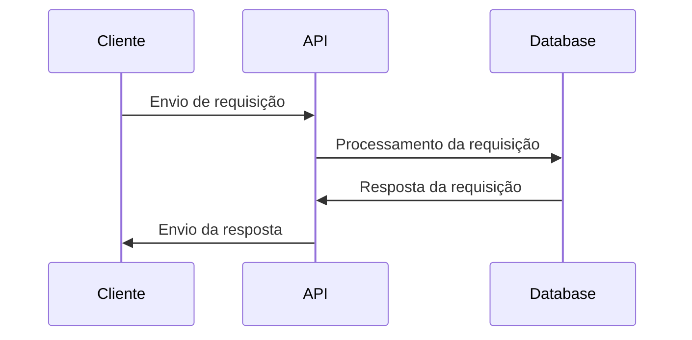

## Introdução a API

Uma API (Application Programming Interface) é uma interface que permite a comunicação entre diferentes componentes de software. Ela fornece um conjunto de regras, protocolos e ferramentas para que as aplicações possam interagir entre si, consumindo dados, serviços ou recursos.

É bastante comum utilizar uma API para consultar uma base de dados. Muitos aplicativos e serviços utilizam APIs para acessar informações de bancos de dados e disponibilizá-las para outros aplicativos.



- O **Cliente** envia uma requisição para a API, representado pela seta "Envio de requisição" que vai até a API.
- A **API**, por sua vez, processa a requisição e a envia para o Database (um servidor de dados), representado pela seta "Processamento da requisição" que vai da API até o Database.

- O **Database** processa a requisição e envia uma resposta para a API, representado pela seta "Resposta da requisição" que vai do Database até a API. Finalmente, a API envia a resposta de volta para o cliente, representado pela seta "Envio da resposta" que vai da API até o cliente.

A importância das APIs tem crescido exponencialmente com a evolução da web e a proliferação de plataformas e dispositivos diferentes. Hoje, existem milhões de APIs disponíveis publicamente, que oferecem uma variedade de serviços e recursos, desde dados meteorológicos até transações financeiras.

Vamos explorar o conceito de API em mais detalhes, analisando as diferentes categorias de APIs e suas características. Também vamos discutir como as APIs podem ser usadas para criar sistemas distribuídos e como o Node.js pode ser uma opção viável para implementar APIs RESTful.

### Tipos de APIs

As APIs podem ser classificadas em diferentes tipos, dependendo de sua finalidade e funcionalidade. Algumas das categorias mais comuns incluem:

#### API de Serviço da Web (Webservice)

Uma API de serviço da web é uma API que fornece acesso a serviços da web, geralmente usando o protocolo HTTP. Ela pode ser implementada usando diferentes tecnologias, como XML-RPC, JSON-RPC, SOAP ou REST.

O protocolo HTTP é amplamente utilizado na internet para transferência de dados entre clientes e servidores. Ele usa uma abordagem de solicitação-resposta, onde o cliente envia uma solicitação ao servidor e espera uma resposta. Essa abordagem é bastante simples e pode ser facilmente implementada por diferentes plataformas e linguagens de programação.

Como exemplo de API Webservice temos a [ViaCEP](https://viacep.com.br/), a API ViaCEP é um serviço gratuito que permite a consulta de endereços brasileiros utilizando o CEP como parâmetro. A seguir vou mostrar como utilizar a API ViaCEP em uma aplicação JavaScript para buscar informações de um endereço.

##### API ViaCEP

A API ViaCEP oferece diferentes formas de consulta, incluindo busca por CEP, endereço ou logradouro. Neste tutorial, vamos utilizar a busca por CEP.

A URL base da API ViaCEP é `https://viacep.com.br/ws/`. Para buscar informações de um endereço a partir do CEP, basta adicionar o CEP à URL e enviar uma requisição HTTP GET.

Por exemplo, para buscar informações do endereço correspondente ao CEP 01310-100, a URL seria:

```url
https://viacep.com.br/ws/01310100/json/
```

Caso seja um CEP valido a resposta da API será um objeto JSON contendo informações como logradouro, bairro, cidade, estado, entre outras, conforme Exemplo:

```json
{
  "cep": "01310-100",
  "logradouro": "Avenida Paulista",
  "complemento": "de 612 a 1510 - lado par",
  "bairro": "Bela Vista",
  "localidade": "São Paulo",
  "uf": "SP",
  "ibge": "3550308",
  "gia": "1004",
  "ddd": "11",
  "siafi": "7107"
} 
```

##### Criando uma função para buscar informações de um endereço a partir do CEP

Agora que entendemos como funciona a API ViaCEP, podemos criar uma função para buscar informações de um endereço a partir do CEP.

```javascript
async function buscaEndereco(cep) {
    try {

      const url = `https://viacep.com.br/ws/${cep}/json/`;
      const response = await fetch(url);
      const data = await response.json();
      console.log(data);
    } catch (error) {
      console.log(error);
    }
  }

buscaEndereco(01310100)
```

Esta função recebe um parâmetro `cep` contendo o CEP que desejamos buscar. Em seguida, montamos a URL da API utilizando o CEP como parâmetro e enviamos uma requisição HTTP GET utilizando a função `fetch`. Por fim, mostramos em tela o resultado, poderiamos tambem retornar os dados da resposta da API no formato JSON, e utiliza-lo em nossos projetos.

#### API RESTful

Uma API RESTful é uma API que segue o estilo arquitetural REST (Representational State Transfer). O REST é um conjunto de princípios para projetar sistemas distribuídos na web. Ele é baseado na ideia de que um recurso na web deve ser identificado por uma URL única e que as operações em torno desse recurso devem ser definidas pelos métodos HTTP padrão (GET, POST, PUT, DELETE).

Os métodos HTTP são utilizados para indicar qual ação deve ser realizada pelo servidor web quando um cliente envia uma requisição. Cada método possui uma finalidade específica e é utilizado de acordo com a operação que se deseja realizar.

- GET: o método GET é utilizado para solicitar informações de um recurso específico. Em outras palavras, é utilizado para buscar dados em um servidor web. As requisições GET são geralmente enviadas através de URLs, e os dados retornados pelo servidor são geralmente exibidos em um navegador web.

- POST: o método POST é utilizado para enviar dados de um cliente para um servidor web, geralmente com o objetivo de criar ou atualizar um recurso no servidor. Por exemplo, um formulário de cadastro pode enviar os dados preenchidos pelo usuário para o servidor utilizando o método POST.

- PUT: o método PUT é utilizado para atualizar um recurso existente no servidor. Ele envia uma requisição para o servidor com os dados atualizados do recurso. Por exemplo, um formulário de edição pode enviar os dados atualizados de um usuário para o servidor utilizando o método PUT.

- DELETE: o método DELETE é utilizado para excluir um recurso específico no servidor. Ele envia uma requisição para o servidor indicando qual recurso deve ser excluído. Por exemplo, um botão "excluir" em uma lista de usuários pode enviar uma requisição DELETE para o servidor para excluir o usuário selecionado.

Cada método HTTP é utilizado para uma finalidade específica, e juntos eles permitem que os desenvolvedores criem APIs RESTful que sejam capazes de realizar operações de criação (Create), leitura (Read), atualização (Update) e exclusão (Delete) de recursos de forma clara e organizada, Essas quatros operações são comumente conhecida pelo acrônimo CRUD.

| Letra do Acrônimo | Operação | Método HTTP | Descrição |
| --- | --- | --- | --- |
| C | Create | POST | Cria um novo recurso no servidor |
| R | Read | GET | Lê os dados de um recurso específico no servidor |
| U | Update | PUT/PATCH | Atualiza um recurso específico no servidor |
| D | Delete | DELETE | Exclui um recurso específico no servidor |

As APIs RESTful são muito populares na web, pois são simples de usar e escalonáveis. Elas permitem que as aplicações possam interagir com diferentes recursos na web, como bancos de dados, sistemas de pagamento, serviços de geolocalização, entre outros.

Como referencia em API RESTful, podemos utilizar o [Swagger Petstore](https://petstore.swagger.io/)  que é um exemplo muito comum e utilizado para demonstrar as funcionalidades  de uma ferramenta popular para documentação de APIs RESTful (Swagger). Ele consiste em uma API RESTful que permite gerenciar uma loja virtual de animais de estimação, como cachorros, gatos, pássaros, entre outros.

A pagina inicial do Swagger Petstore pode se acessada em:

```url
https://petstore.swagger.io/
```

Lá você ira encontrar várias rotas, como "Adicionar um novo animal", "Buscar animais por status" e "Atualizar o status de um animal". Cada rota é documentada utilizando a especificação Swagger, que define os métodos HTTP suportados, os parâmetros necessários, os exemplos de entrada e saída, além de outras informações relevantes.

O Swagger Petstore também inclui uma interface interativa do **Swagger UI**, que permite que os usuários visualizem a documentação da API, realizem testes e até mesmo experimentem as operações disponíveis diretamente da documentação.

#### API SOAP

Uma API SOAP é uma API que usa o protocolo SOAP (Simple Object Access Protocol) para fornecer serviços da web. O SOAP é um protocolo baseado em XML que define como as mensagens devem ser formatadas e transmitidas. Ele é um protocolo mais antigo e mais complexo que o REST, mas ainda é usado em algumas aplicações que exigem segurança e confiabilidade.

Em geral, as APIs SOAP são mais complexas e verbosas do que as APIs RESTful, mas oferecem recursos mais avançados, como autenticação, segurança e transações. No entanto, elas também podem ser mais difíceis de implementar e manter devido à sua complexidade.
