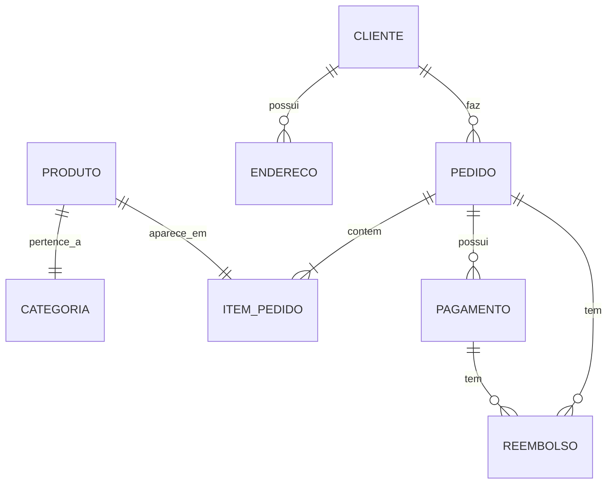

## API RESTful com Node.js

O Node.js é uma plataforma de desenvolvimento de software baseada em JavaScript. Ela permite que os desenvolvedores possam escrever aplicativos do lado do servidor usando a mesma linguagem de programação do lado do cliente.

Para implementar uma API RESTful com Node.js, é necessário seguir alguns passos básicos:

1. Instale o Node.js no seu sistema.
2. Crie um projeto Node.js usando o npm (Node Package Manager).
3. Instale os pacotes necessários para implementar a API RESTful, como o Express (um framework para construção de aplicativos web), o Body-parser (para análise de corpo de solicitação HTTP) e o CORS (para controle de acesso à API).
4. Defina o modelo conceitual de dados e o modelo de dados da API, usando ferramentas como o Sequelize (para bancos de dados SQL).
5. Defina as rotas da API, definindo os métodos HTTP e as operações em torno dos recursos.
6. Utilizar ferramentas como o Swagger para e documentar APIs de forma automatizada permitindo realizar  testes de solicitação HTTP.

O Node.js é uma opção viável para implementar APIs RESTful, pois ele fornece um conjunto de recursos e ferramentas para construir aplicativos escaláveis e de alta performance. Ele também é compatível com diferentes bancos de dados e provedores de serviços de nuvem, o que o torna uma opção popular para construção de sistemas distribuídos.

## Iniciando um projeto Node.js

Para criar um projeto de API RESTful em Node.js siga as seguintes etapas:

### 1 Instalando Node.js

Para seguir este guia, recomendamos que você utilize Ubuntu 20.04. Antes de começar, você deve ter uma conta de usuário com privilégios  de ´sudo´ configurados em seu sistema.

Para instalar o Node.js no Linux, siga os seguintes passos:

#### Passo 1: Abra o terminal

Abra o terminal no seu sistema Linux. O terminal pode ser encontrado no menu de aplicativos ou pressionando a tecla de atalho `Ctrl + Alt + T`.

#### Passo 2: Atualize o gerenciador de pacotes

Antes de instalar o Node.js, é recomendável atualizar o gerenciador de pacotes para garantir que você esteja baixando a versão mais recente. Use o seguinte comando no terminal:

```bash
sudo apt update
```

#### Passo 3: Instale o Node.js

Existem diferentes formas de instalar o Node.js no Linux, mas neste exemplo, usaremos o gerenciador de pacotes `apt` no Ubuntu ou no Debian. Use o seguinte comando para instalar o Node.js:

```bash
sudo apt install nodejs
```

Além disso, você também precisa instalar o gerenciador de pacotes npm (Node Package Manager), que é usado para instalar pacotes e bibliotecas JavaScript. Use o seguinte comando para instalar o npm:

```bash
sudo apt install npm
```

#### Passo 4: Verifique a instalação

Após a instalação do Node.js e npm, você pode verificar se tudo foi instalado corretamente executando o seguinte comando no terminal:

```bash
node -v
```

Este comando irá exibir a versão do Node.js instalada no seu sistema. Para verificar a versão do npm, use o seguinte comando:

```bash
npm -v
```

Instalar o Node.js no Linux é um processo simples e fácil, usando o gerenciador de pacotes `apt`. Certifique-se de atualizar o gerenciador de pacotes antes de instalar o Node.js e npm, e verifique se tudo foi instalado corretamente executando os comandos de verificação.

O Node.js é uma plataforma versátil que pode ser usada para desenvolver uma ampla gama de aplicativos, desde aplicativos web simples até aplicativos de rede complexos em tempo real. Ele é mantido pela Node.js Foundation, uma organização sem fins lucrativos que é responsável por coordenar o desenvolvimento, promover a adoção, fornecer suporte e garantir a estabilidade e a segurança da plataforma. Com sua arquitetura orientada a eventos e I/O assíncrono, o Node.js é capaz de lidar com muitas conexões simultâneas e escalonar facilmente para lidar com grandes cargas de trabalho.

### 2. Crie um projeto Node.js

#### Passo 1 Crie um diretório para o projeto e navegue até ele

```bash
mkdir projetos/nome-do-projeto #cria um diretório
cd projetos/nome-do-projeto ## move até o diretório
```

Lembre-se organizar seu ambiente de desenvolvimento é uma parte importante para garantir uma experiência de programação eficiente e produtiva, neste caso criamos um diretório `projetos` onde armazenaremos nossas aplicaçoes.

#### Passo 2 Inicialize o projeto Node.js com o npm

```bash
npm init -y
```

Isso irá criar um arquivo `package.json` no diretório do projeto, que contém informações sobre o projeto e suas dependências. O arquivo package.json é um arquivo em formato JSON que contém metadados sobre o projeto e suas dependências.

Este arquivo é importante porque ele armazena informações sobre as dependências do projeto, scripts, configurações e outras informações importantes que serão utilizadas para gerenciar o projeto.

Aqui está um exemplo de um arquivo package.json típico:

```json
{
  "name": "exemplo",
  "version": "1.0.0",
  "description": "Exemplo de aplicação Node.js",
  "main": "index.js",
  "scripts": {
    "start": "node index.js"
  },
  "dependencies": {
    "express": "^4.17.1"
  },
  "devDependencies": {
    "nodemon": "^2.0.7"
  },
  "engines": {
    "node": ">=14.0.0",
    "npm": ">=7.0.0"
  },
  "license": "MIT",
  "repository": {
    "type": "git",
    "url": "https://github.com/nome-do-repositorio.git"
  },
  "author": {
    "name": "Nome do Autor",
    "email": "email@dominio.com"
  },
  "keywords": [
    "node",
    "exemplo",
    "rest",
    "api"
  ],
  "contributors": [
    {
      "name": "Nome do Contribuidor",
      "email": "email@dominio.com"
    }
  ]
}
```

Vejamos agora o que cada um desses campos significa:

- `name`: é o nome do seu projeto e deve ser único no registro de pacotes do npm.

- `version`: é a versão atual do seu projeto.

- `description`: é uma descrição breve do seu projeto.

- `main`: é o arquivo principal do seu projeto.

- `scripts`: é um objeto que contém vários comandos que podem ser executados para realizar tarefas específicas, como iniciar a aplicação ou executar testes automatizados.

- `dependencies`: é um objeto que contém todas as dependências que sua aplicação precisa para rodar corretamente. Essas dependências serão instaladas automaticamente pelo npm.

- `devDependencies`: é um objeto que contém todas as dependências que são necessárias apenas durante o desenvolvimento da aplicação, como por exemplo, testes automatizados. Essas dependências não serão instaladas quando a aplicação for instalada em um ambiente de produção.

- `engines`: é um objeto que especifica a versão mínima do Node.js e do npm necessária para rodar sua aplicação.

- `license`: é a licença sob a qual seu projeto é disponibilizado.

- `repository`: é a URL do repositório do seu projeto.

- `author`: é o nome do autor do projeto e seu email.

- `keywords`: são palavras-chave que descrevem seu projeto. Essas palavras-chave são usadas pelo npm para categorizar seu projeto e facilitar a busca.

- `contributors`: é uma lista de contribuidores do projeto.

Essas são algumas das principais propriedades que podem ser encontradas em um arquivo package.json. Além dessas, existem outras propriedades que podem ser definidas, dependendo das necessidades do projeto.
Em resumo, o arquivo package.json é fundamental em projetos Node.js, pois ele ajuda a gerenciar dependências, configurar scripts e outras configurações importantes para o projeto.

Ao final desta etapa você terá a seguinte estrutura de diretório:

```tree
nome-do-projeto/
  |- package.json
```

- `nome-do-projeto/`: é o diretório raiz do projeto, que contém todos os arquivos e diretórios relacionados ao projeto.
- `package.json`: é um arquivo que descreve as informações do projeto, incluindo o nome do projeto, a versão do projeto, as dependências do projeto, as configurações de script, o autor, a licença e outras informações importantes. O arquivo é usado pelo npm para instalar as dependências do projeto e executar scripts relacionados ao projeto.

Ao final desta etapa você terá a seguinte estrutura de diretório:

```bash
nome-do-projeto/
  |- package.json
```

- `nome-do-projeto/`: é o diretório raiz do projeto, que contém todos os arquivos e diretórios relacionados ao projeto.
- `package.json`: é um arquivo que descreve as informações do projeto, incluindo o nome do projeto, a versão do projeto, as dependências do projeto, as configurações de script, o autor, a licença e outras informações importantes. O arquivo é usado pelo npm para instalar as dependências do projeto e executar scripts relacionados ao projeto.

### 3. Instale os pacotes necessários

#### Instale os pacotes necessários para criar uma API RESTful em Node.js

  ```bash
  npm i express body-parser cors 

  ```

  O pacote `express` é o framework para criação de aplicações Node.js, `body-parser` é usado para analisar o corpo das requisições HTTP e `cors` é utilizado para habilitar o acesso de outras origens (como outros servidores) à API.

Ao final desta etapa você terá a seguinte estrutura de diretório:

```tree
nome-do-projeto/
  |- node_modules/
  |- package-lock.json
  |- package.json

```

- `node_modules/`: é o diretório onde os pacotes de terceiros instalados pelo npm são armazenados.
- `package-lock.json`: é um arquivo gerado automaticamente pelo npm para garantir que as dependências do projeto sejam instaladas com a mesma versão, mesmo que o arquivo `package.json` tenha um caractere curinga `^` em suas dependências.

### 4. Defina ou Receba o modelo conceitual de dados

Um modelo conceitual de dados pode ser representado de diversas formas, dependendo do contexto de uso e das necessidades da aplicação. por exemplo um diagrama entidade-relacionamento (ER) que descreve as entidades (tabelas), os atributos (colunas) e os relacionamentos entre essas entidades.Imagine uma aplicação de e-commerce que precisa armazenar informações sobre produtos, clientes e pedidos. Para cada uma dessas entidades, é necessário criar um modelo de dados que defina os campos e as relações com outras entidades. O modelo de dados para a entidade "produto", por exemplo, pode incluir campos como nome, descrição, preço e quantidade em estoque. Por exemplo, em uma aplicação de e-commerce, podemos ter as seguintes entidades:

- Produto: representa um item que está à venda na loja online. Pode ter atributos como nome, descrição, preço e quantidade em estoque.
- Categoria: representa uma categoria na qual um produto pode ser classificado. Pode ter atributos como nome e descrição.
- Cliente: representa um usuário que está navegando e comprando na loja online. Pode ter atributos como nome, e-mail e senha.
- Endereço: representa o endereço de um cliente. Pode ter atributos como rua, número, complemento, cidade, estado e CEP.
- Pedido: representa um pedido feito por um cliente. Pode ter atributos como data de criação, status e valor total.
- Item pedido: representa um item que foi adicionado a um pedido. Pode ter atributos como quantidade e valor unitário.
- Pagamento: representa um pagamento feito por um cliente para um pedido. Pode ter atributos como data de criação, valor e status.
- Reembolso: representa um reembolso que foi emitido para um cliente em relação a um pedido. Pode ter atributos como data de criação, valor e status.

Um diagrama ER simples para este modelo de dados seria:


Nesse diagrama, cada tabela é representada por um retângulo, e os relacionamentos entre as tabelas são indicados por linhas que conectam os retângulos. A cardinalidade do **relacionamento** é indicada por símbolos no final de cada linha.

Uma vez definido o modelo conceitual de dados, podemos utilizá-lo para criar o modelo de dados em Node.js que ira realizar operações no banco de dados, como inserir novos registros, atualizar informações existentes ou recuperar dados para exibir na interface do usuário. Isso é feito através de um ORM, que traduz as operações de banco de dados em chamadas a métodos do modelo correspondente.

### 5 Modelo de dados Node.js e ORM Sequelize

Em resumo, os modelos de dados são uma abstração importante na arquitetura de uma aplicação Node que utiliza um banco de dados, pois permitem que os desenvolvedores trabalhem com os dados de forma estruturada e organizada, facilitando a manutenção e a evolução da aplicação ao longo do tempo.

#### ORM

ORM (Object-Relational Mapping) é uma técnica de programação que permite mapear objetos de um modelo de programação para uma tabela em um banco de dados relacional. Isso permite que o desenvolvedor trabalhe com objetos em vez de escrever diretamente SQL para interagir com o banco de dados.

O ORM fornece uma camada de abstração entre o código da aplicação e o banco de dados, permitindo que as consultas SQL sejam geradas automaticamente com base nas operações feitas nos objetos. Isso torna o desenvolvimento de aplicativos mais produtivo e reduz a complexidade de escrever e manter o código SQL.

Geralmente os ORMs têm a capacidade de realizar operações básicas de CRUD (criação, leitura, atualização e exclusão) em tabelas de banco de dados, bem como gerenciar as relações entre as tabelas. Alguns exemplos de ORMs populares incluem Sequelize para Node.js, Hibernate para Java e Entity Framework para .NET, SQLAlchemy para Python, entre outras.

Embora possam ter um impacto positivo no desenvolvimento de aplicativos, Os ORMs também têm algumas desvantagens. Por exemplo, pode ser menos eficiente do que o SQL direto, pois a geração de SQL pode adicionar camadas adicionais de abstração e, portanto, diminuir a velocidade de execução. Além disso, os ORMs podem ser menos flexíveis do que o SQL direto, pois a geração automática de SQL pode ser limitada em alguns casos específicos.

#### Sequelize

O Sequelize é um Object-Relational Mapping (ORM) para Node.js, que permite trabalhar com bancos de dados relacionais de forma mais fácil e produtiva. O Sequelize é uma ferramenta poderosa e fácil de usar, que oferece suporte a vários bancos de dados relacionais e recursos avançados, como migrações de banco de dados.Para utilizar o Sequelize em um projeto Node.js, é necessário instalá-lo através do NPM (Node Package Manager). Abaixo está o comando para instalar o `Sequelize`:

```bash
npm i sequelize pg
```

O pacote `pg` é utilizado para a comunicação entre o `Sequelize` e o SGBD PostgreSQL.

Após a instalação, é necessário configurar a conexão com o banco de dados PostgreSQL. Para isso, podemos criar um arquivo `database.js` com as informações necessárias para a conexão, é uma boa prática em uma aplicação Node.js separar os arquivos de configuração em um diretório config. Essa separação ajuda a manter o código organizado e facilita a manutenção, uma vez que as configurações estão centralizadas em um só lugar.

```javascript
// config/database.js
const Sequelize = require('sequelize');
const sequelize = new Sequelize('nome_do_banco', 'usuário', 'senha', {
  host: 'localhost',
  dialect: 'postgres'
});

module.exports = sequelize;
```

O codigo acima define uma conexão com o banco de dados. Vou comentar cada linha do código para que você possa entender melhor:

```javascript
// config/database.js
const Sequelize = require('sequelize');
```

Nesta linha de código, o módulo Sequelize é importado e atribuído a uma constante chamada `Sequelize`.

```javascript
// config/database.js
const sequelize = new Sequelize('nome_do_banco', 'usuário', 'senha', {
  host: 'localhost',
  dialect: 'postgres'
});
```

Esta linha de código cria uma nova instância do objeto Sequelize, que representa uma conexão com o banco de dados. Os parâmetros passados na criação desta instância são:

- `'nome_do_banco'`: o nome do banco de dados que se deseja conectar
- `'usuário'`: o nome de usuário utilizado para acessar o banco de dados
- `'senha'`: a senha utilizada para acessar o banco de dados
- `{ host: 'localhost', dialect: 'postgres' }`: um objeto que contém informações adicionais sobre a conexão, como o host onde o banco de dados está localizado e o dialeto utilizado (neste caso, PostgreSQL).

```javascript
// config/database.js
module.exports = sequelize;
```

Por fim, a conexão criada é exportada como um módulo, permitindo que ela seja utilizada em outras partes da aplicação. Neste caso, a conexão será exportada como o objeto `sequelize`.

Ao final desta etapa você terá a seguinte estrutura de diretório:

```tree
nome-do-projeto/
  |- config/
  |   |- database.js
  |- node_modules/
  |- package-lock.json
  |- package.json

```

- `config/`: lembre-se este diretório que contém arquivos de configuração para o seu aplicativo, incluindo arquivos de configuração de banco de dados e outros parâmetros globais.

##### Criando Modelos e Tabelas

Após a configuração da conexão com o banco de dados, podemos criar modelos para as tabelas que serão utilizadas na aplicação. Os modelos são definidos utilizando o Sequelize e representam as tabelas do banco de dados.

Uma boa prática salvar os modelos de banco de dados em uma aplicação Node é em um diretório chamado "models". Isso ajuda a manter uma estrutura organizada do projeto, facilita a localização dos arquivos e ajuda a evitar confusão com outros tipos de arquivos, como rotas ou controladores.

Ao salvar os modelos em um diretório separado, é possível também criar subdiretórios para organizar os modelos por categoria, se for necessário. Por exemplo, é possível ter um diretório "models/produtos/" para todos os modelos relacionados a produtos ou a um determinado subgrupo, más tenha cuidado para não se perder, mantenha o seu código o mais organizado possível, e lembre-se que outros desenvolvedores podem dar continuidade ao seu projeto.

Com base no modelo conceitual de dados, podemos começar a criar o modelo de dados usando o Sequelize.

Para cada entidade, precisamos criar um `ORM` correspondente no nosso diretorio `models`. Vamos criar um arquivo separado para cada modelo, seguindo o padrão de nomenclatura do Sequelize.

Começaremos criando a tabela "Categoria" com os seguintes campos: id, nome e descricao. O arquivo de modelo para Categoria deve ficar assim:

```javascript
// models/categoria.js

const { Model, DataTypes } = require('sequelize');
const sequelize = require('../database');

class Categoria extends Model {}

Categoria.init({
  id: {
    type: DataTypes.INTEGER,
    primaryKey: true,
    autoIncrement: true,
  },
  nome: {
    type: DataTypes.STRING,
    allowNull: false,
  },
  descricao: {
    type: DataTypes.TEXT,
    allowNull: true,
  },
}, {
  sequelize,
  modelName: 'Categoria',
});

module.exports = Categoria;

```

vamos entender melhor o que acontece à cada linha:

1. `const { Model, DataTypes } = require('sequelize');`
    Nesta linha, importamos as classes `Model` e `DataTypes` do pacote `sequelize`. `Model` é uma classe base que define a estrutura de um modelo e `DataTypes` são os tipos de dados disponíveis no Sequelize.

2. `const sequelize = require('../database');`
    Aqui estamos importando a instância do Sequelize que foi criada e configurada no arquivo `database.js`, que está um nível acima no diretório.

3. `class Categoria extends Model {}`
    Nesta linha, estamos declarando a classe `Categoria`, que estende a classe `Model` do Sequelize. Isso significa que a classe `Categoria` terá acesso aos métodos e propriedades definidos na classe `Model`.

4. `Categoria.init({`
    Aqui estamos iniciando a definição do modelo `Categoria`, especificando seus campos e configurações.

5. `id: {`
    Esta linha define o campo `id` do modelo `Categoria`, que é uma chave primária e é do tipo `DataTypes.INTEGER`.

6. `type: DataTypes.INTEGER,`
    Aqui estamos definindo o tipo de dados do campo `id` como `DataTypes.INTEGER`.

7. `primaryKey: true,`
    Esta linha define que o campo `id` é uma chave primária.

8. `autoIncrement: true,`
    Aqui estamos configurando o campo `id` para ser autoincrementável.

9. `nome: {`
    Esta linha define o campo `nome` do modelo `Categoria`, que é do tipo `DataTypes.STRING` e não permite valores nulos (`allowNull: false`).

10. `descricao: {`
    Aqui estamos definindo o campo `descricao` do modelo `Categoria`, que é do tipo `DataTypes.TEXT` e permite valores nulos (`allowNull: true`).

11. `}, {`
    Aqui estamos fechando o objeto de definição dos campos e passando as opções de configuração para o modelo.

12. `sequelize,`
    Esta linha configura a instância do Sequelize que será usada para definir o modelo.

13. `modelName: 'Categoria',`
    Aqui estamos definindo o nome do modelo como `'Categoria'`.

14. `});`
    Esta linha encerra a definição do modelo.

15. `module.exports = Categoria;`
    Aqui estamos exportando a classe `Categoria` para que possa ser usada em outros arquivos.

Podemos criar os modelos restantes seguindo o mesmo padrão, é possível criar um arquivo "index.js" que importa e define todos os modelos de uma vez, permitindo uma fácil inicialização do banco de dados. O arquivo "index.js" pode ter o seguinte formato:

```javascript
// models/index.js
const Sequelize = require('sequelize');
const sequelize = new Sequelize('nome_do_banco', 'usuário', 'senha', {
  host: 'localhost',
  dialect: 'postgres'
});

const models = {
  Produto: sequelize.import('./Produto'),
  Categoria: sequelize.import('./Categoria'),
  Cliente: sequelize.import('./Cliente'),
  Endereco: sequelize.import('./Endereco'),
  Pedido: sequelize.import('./Pedido'),
  ItemPedido: sequelize.import('./ItemPedido'),
  Pagamento: sequelize.import('./Pagamento'),
  Reembolso: sequelize.import('./Reembolso'),
};

Object.keys(models).forEach((modelName) => {
  if ('associate' in models[modelName]) {
    models[modelName].associate(models);
  }
});

models.sequelize = sequelize;
models.Sequelize = Sequelize;

module.exports = models;
```

Nesse exemplo, o arquivo "index.js" importa todos os modelos e define as associações entre eles. Ao final, o arquivo exporta um objeto com todos os modelos e as instâncias do Sequelize.

Com as tabelas criadas no banco de dados, podemos utilizar o Sequelize para realizar operações de inserção, alteração e remoção de registros. Para isso, podemos utilizar os métodos `create`, `update

### 5. Defina as rotas da API
Ao final desta etapa você terá a seguinte estrutura de diretório:

- `node_modules/`: é o diretório onde os pacotes de terceiros instalados pelo npm são armazenados.
- `package-lock.json`: é um arquivo gerado automaticamente pelo npm para garantir que as dependências do projeto sejam instaladas com a mesma versão, mesmo que o arquivo package.json tenha um caractere curinga `^` em suas dependências.

### 4. Modelo de dados

Em resumo, o modelo de dados de uma API se baseia na estrutura dos recursos que a API disponibiliza e nos dados que são trocados entre a API e seus clientes. Ele é uma descrição estruturada que define como os dados devem ser formatados e estruturados para serem enviados e recebidos corretamente.

O modelo de dados também pode incluir informações sobre os relacionamentos entre diferentes recursos, como um pedido que contém vários itens de produtos. Essas informações são importantes para garantir que os dados sejam trocados corretamente entre a API e seus clientes.

#### Modelo conceitual de dados

Um modelo conceitual de dados pode ser representado de diversas formas, dependendo do contexto de uso e das necessidades da aplicação. por exemplo um diagrama entidade-relacionamento (ER) que descreve as entidades (tabelas), os atributos (colunas) e os relacionamentos entre essas entidades.Imagine uma aplicação de e-commerce que precisa armazenar informações sobre produtos, clientes e pedidos. Para cada uma dessas entidades, é necessário criar um modelo de dados que defina os campos e as relações com outras entidades. O modelo de dados para a entidade "produto", por exemplo, pode incluir campos como nome, descrição, preço e quantidade em estoque. Por exemplo, em uma aplicação de e-commerce, podemos ter as seguintes entidades:

- **Produto**: representa um item que está à venda na loja online. Pode ter atributos como nome, descrição, preço e quantidade em estoque.
- **Categoria**: representa uma categoria na qual um produto pode ser classificado. Pode ter atributos como nome e descrição.
- **Cliente**: representa um usuário que está navegando e comprando na loja online. Pode ter atributos como nome, e-mail e senha.
- **Endereço**: representa o endereço de um cliente. Pode ter atributos como rua, número, complemento, cidade, estado e CEP.
- **Pedido**: representa um pedido feito por um cliente. Pode ter atributos como data de criação, status e valor total.
- **ItemPedido**: representa um item que foi adicionado a um pedido. Pode ter atributos como quantidade e valor unitário.
- **Pagamento**: representa um pagamento feito por um cliente para um pedido. Pode ter atributos como data de criação, valor e status.
- **Reembolso**: representa um reembolso que foi emitido para um cliente em relação a um pedido. Pode ter atributos como data de criação, valor e status.

Um diagrama conceitual para este modelo de dados seria:



Nesse diagrama, cada tabela é representada por um retângulo, e os relacionamentos entre as tabelas são indicados por linhas que conectam os retângulos. A cardinalidade do relacionamento é indicada por símbolos no final de cada linha.

Uma vez definido o modelo conceitual de dados, podemos utilizá-lo para criar o modelo de dados em Node.js que ira realizar operações no banco de dados, como inserir novos registros, atualizar informações existentes ou recuperar dados para exibir na interface do usuário. Isso é feito através de um ORM, que traduz as operações de banco de dados em chamadas a métodos do modelo correspondente.

### 5 Modelo de dados Node.js e ORM Sequelize

Em resumo, os modelos de dados são uma abstração importante na arquitetura de uma aplicação Node que utiliza um banco de dados, pois permitem que os desenvolvedores trabalhem com os dados de forma estruturada e organizada, facilitando a manutenção e a evolução da aplicação ao longo do tempo.

#### ORM

ORM (Object-Relational Mapping) é uma técnica de programação que permite mapear objetos de um modelo de programação para uma tabela em um banco de dados relacional. Isso permite que o desenvolvedor trabalhe com objetos em vez de escrever diretamente SQL para interagir com o banco de dados.

O ORM fornece uma camada de abstração entre o código da aplicação e o banco de dados, permitindo que as consultas SQL sejam geradas automaticamente com base nas operações feitas nos objetos. Isso torna o desenvolvimento de aplicativos mais produtivo e reduz a complexidade de escrever e manter o código SQL.

Geralmente os ORMs têm a capacidade de realizar operações básicas de CRUD (criação, leitura, atualização e exclusão) em tabelas de banco de dados, bem como gerenciar as relações entre as tabelas. Alguns exemplos de ORMs populares incluem Sequelize para Node.js, Hibernate para Java e Entity Framework para .NET, SQLAlchemy para Python, entre outras.

Embora possam ter um impacto positivo no desenvolvimento de aplicativos, Os ORMs também têm algumas desvantagens. Por exemplo, pode ser menos eficiente do que o SQL direto, pois a geração de SQL pode adicionar camadas adicionais de abstração e, portanto, diminuir a velocidade de execução. Além disso, os ORMs podem ser menos flexíveis do que o SQL direto, pois a geração automática de SQL pode ser limitada em alguns casos específicos.

#### Sequelize

O Sequelize é um Object-Relational Mapping (ORM) para Node.js, que permite trabalhar com bancos de dados relacionais de forma mais fácil e produtiva. O Sequelize é uma ferramenta poderosa e fácil de usar, que oferece suporte a vários bancos de dados relacionais e recursos avançados, como migrações de banco de dados.Para utilizar o Sequelize em um projeto Node.js, é necessário instalá-lo através do NPM (Node Package Manager). Abaixo está o comando para instalar o Sequelize:

```bash
npm i sequelize pg
```

O pacote pg é utilizado para a comunicação entre o Sequelize e o SGBD PostgreSQL.

Após a instalação, é necessário configurar a conexão com o banco de dados PostgreSQL. Para isso, podemos criar um arquivo database.js com as informações necessárias para a conexão, é uma boa prática em uma aplicação Node.js separar os arquivos de configuração em um diretório config. Essa separação ajuda a manter o código organizado e facilita a manutenção, uma vez que as configurações estão centralizadas em um só lugar.

```javascript
// config/database.js
const Sequelize = require('sequelize');
const sequelize = new Sequelize('nome_do_banco', 'usuário', 'senha', {
  host: 'localhost',
  dialect: 'postgres'
});

module.exports = sequelize;
```

O codigo acima define uma conexão com o banco de dados. Vou comentar cada linha do código para que você possa entender melhor:

```javascript
// config/database.js
const Sequelize = require('sequelize');
```

Nesta linha de código, o módulo Sequelize é importado e atribuído a uma constante chamada `Sequelize`.

```javascript
// config/database.js
const sequelize = new Sequelize('nome_do_banco', 'usuário', 'senha', {
  host: 'localhost',
  dialect: 'postgres'
});
```

Esta linha de código cria uma nova instância do objeto Sequelize, que representa uma conexão com o banco de dados. Os parâmetros passados na criação desta instância são:

- 'nome_do_banco': o nome do banco de dados que se deseja conectar
- 'usuário': o nome de usuário utilizado para acessar o banco de dados
- 'senha': a senha utilizada para acessar o banco de dados
- { host: 'localhost', dialect: 'postgres' }: um objeto que contém informações adicionais sobre a conexão, como o host onde o banco de dados está localizado e o dialeto utilizado (neste caso, PostgreSQL).

```javascript
// config/database.js
module.exports = sequelize;
```

Por fim, a conexão criada é exportada como um módulo, permitindo que ela seja utilizada em outras partes da aplicação. Neste caso, a conexão será exportada como o objeto `sequelize`.

Ao final desta etapa você terá a seguinte estrutura de diretório:

```bash
nome-do-projeto/
  |- config/
  |   |- database.js
  |- node_modules/
  |- package-lock.json
  |- package.json
```

- `config/`: lembre-se este diretório que contém arquivos de configuração para o seu aplicativo, incluindo arquivos de configuração de banco de dados e outros parâmetros globais.

#### Criando Modelos e Tabelas

Após a configuração da conexão com o banco de dados, podemos criar modelos para as tabelas que serão utilizadas na aplicação. Os modelos são definidos utilizando o Sequelize e representam as tabelas do banco de dados.

Uma boa prática salvar os modelos de banco de dados em uma aplicação Node é em um diretório chamado "models". Isso ajuda a manter uma estrutura organizada do projeto, facilita a localização dos arquivos e ajuda a evitar confusão com outros tipos de arquivos, como rotas ou controladores.

Ao salvar os modelos em um diretório separado, é possível também criar subdiretórios para organizar os modelos por categoria, se for necessário. Por exemplo, é possível ter um diretório "models/produtos/" para todos os modelos relacionados a produtos ou a um determinado subgrupo, más tenha cuidado para não se perder, mantenha o seu código o mais organizado possível, e lembre-se que outros desenvolvedores podem dar continuidade ao seu projeto.

Com base no modelo conceitual de dados, podemos começar a criar o modelo de dados usando o Sequelize.

Para cada entidade, precisamos criar um **ORM** correspondente no nosso diretorio models. Vamos criar um arquivo separado para cada modelo, seguindo o padrão de nomenclatura do Sequelize.

Começaremos criando a tabela "Categoria" com os seguintes campos: id, nome e descricao. O arquivo de modelo para Categoria deve ficar assim:

```javascript
// models/categoria.js

const { Model, DataTypes } = require('sequelize');
const sequelize = require('../database');

class Categoria extends Model {}

Categoria.init({
  id: {
    type: DataTypes.INTEGER,
    primaryKey: true,
    autoIncrement: true,
  },
  nome: {
    type: DataTypes.STRING,
    allowNull: false,
  },
  descricao: {
    type: DataTypes.TEXT,
    allowNull: true,
  },
}, {
  sequelize,
  modelName: 'Categoria',
});

module.exports = Categoria;
```

vamos entender melhor o que acontece à cada linha:

Claro, aqui está a explicação linha a linha do código:

1. `const { Model, DataTypes } = require('sequelize');`
   - Nesta linha, importamos as classes `Model` e `DataTypes` do pacote `sequelize`. `Model` é uma classe base que define a estrutura de um modelo e `DataTypes` são os tipos de dados disponíveis no Sequelize.

2. `const sequelize = require('../database');`
   - Aqui estamos importando a instância do Sequelize que foi criada e configurada no arquivo `database.js`, que está um nível acima no diretório.

3. `class Categoria extends Model {}`
   - Nesta linha, estamos declarando a classe `Categoria`, que estende a classe `Model` do Sequelize. Isso significa que a classe `Categoria` terá acesso aos métodos e propriedades definidos na classe `Model`.

4. `Categoria.init({`
   - Aqui estamos iniciando a definição do modelo `Categoria`, especificando seus campos e configurações.

5. `id: {`
   - Esta linha define o campo `id` do modelo `Categoria`, que é uma chave primária e é do tipo `DataTypes.INTEGER`.

6. `type: DataTypes.INTEGER,`
   - Aqui estamos definindo o tipo de dados do campo `id` como `DataTypes.INTEGER`.

7. `primaryKey: true,`
   - Esta linha define que o campo `id` é uma chave primária.

8. `autoIncrement: true,`
   - Aqui estamos configurando o campo `id` para ser autoincrementável.

9. `nome: {`
   - Esta linha define o campo `nome` do modelo `Categoria`, que é do tipo `DataTypes.STRING` e não permite valores nulos (`allowNull: false`).

10. `descricao: {`
    - Aqui estamos definindo o campo `descricao` do modelo `Categoria`, que é do tipo `DataTypes.TEXT` e permite valores nulos (`allowNull: true`).

11. `}, {`
    - Aqui estamos fechando o objeto de definição dos campos e passando as opções de configuração para o modelo.

12. `sequelize,`
    - Esta linha configura a instância do Sequelize que será usada para definir o modelo.

13. `modelName: 'Categoria',`
    - Aqui estamos definindo o nome do modelo como `'Categoria'`.

14. `});`
    - Esta linha encerra a definição do modelo.

15. `module.exports = Categoria;`
    - Aqui estamos exportando a classe `Categoria` para que possa ser usada em outros arquivos.

Podemos criar os modelos restantes seguindo o mesmo padrão, é possível criar um arquivo "index.js" que importa e define todos os modelos de uma vez, permitindo uma fácil inicialização do banco de dados. O arquivo "index.js" pode ter o seguinte formato:

```javascript
// models/index.js
const Sequelize = require('sequelize');
const sequelize = new Sequelize('nome_do_banco', 'usuário', 'senha', {
  host: 'localhost',
  dialect: 'postgres'
});

const models = {
  Produto: sequelize.import('./Produto'),
  Categoria: sequelize.import('./Categoria'),
  Cliente: sequelize.import('./Cliente'),
  Endereco: sequelize.import('./Endereco'),
  Pedido: sequelize.import('./Pedido'),
  ItemPedido: sequelize.import('./ItemPedido'),
  Pagamento: sequelize.import('./Pagamento'),
  Reembolso: sequelize.import('./Reembolso'),
};

Object.keys(models).forEach((modelName) => {
  if ('associate' in models[modelName]) {
    models[modelName].associate(models);
  }
});

models.sequelize = sequelize;
models.Sequelize = Sequelize;

module.exports = models;
```

Nesse exemplo, o arquivo "index.js" importa todos os modelos e define as associações entre eles. Ao final, o arquivo exporta um objeto com todos os modelos e as instâncias do Sequelize.

Com as tabelas criadas no banco de dados, podemos utilizar o Sequelize para realizar operações de inserção, alteração e remoção de registros. Para isso, podemos utilizar os métodos `create`, `update`

### 5. Defina as rotas da API

#### Passo 1 Crie um arquivo `index.js` no diretório do projeto e configure o servidor express

```js
const express = require('express');
const bodyParser = require('body-parser');
const cors = require('cors');

const app = express();
const port = 3000;

app.use(cors());
app.use(bodyParser.json());

app.get('/', (req, res) => {
    res.send('Bem-vindo à API RESTful');
});

app.listen(port, () => {
    console.log(`Servidor iniciado em http://localhost:${port}`);
});
```

Vamos entender o que está acontecendo em cada linha do código:

```js
const express = require('express');
```

Importando o módulo `express` para o nosso código. O `express` é um framework para criação de aplicações web em Node.js. A palavra-chave `const` é utilizada para declarar uma constante.

```js
const bodyParser = require('body-parser');
```

Importando o módulo `body-parser` que é um middleware para análise do corpo das requisições HTTP.

```js
const cors = require('cors');
```

Importando o módulo `cors` que é um middleware que permite o acesso de outras origens à API.

```js
const app = express();
```

Aqui estamos criando a nossa aplicação express, que será utilizada para configurar as rotas e endpoints da API.

```js
const port = 3000;
```

Definimos uma variável para a porta em que o servidor express será iniciado.

```js
app.use(cors());
app.use(bodyParser.json());
```

Utilizamos os middlewares `cors` e `body-parser` que importamos anteriormente para nossa aplicação express. O `cors` habilita o acesso de outras origens à API e o `body-parser` analisa o corpo das requisições HTTP.

```js
app.get('/', (req, res) => {
  res.send('Bem-vindo à API RESTful');
});
```

Definindo uma rota para a raiz da nossa aplicação (`/`). Quando um usuário acessar essa rota, a API enviará como resposta uma mensagem de boas-vindas.

```js
app.listen(port, () => {
  console.log(`Servidor iniciado em http://localhost:${port}`);
});
```

Finalmente, aqui estamos iniciando o servidor express na porta definida anteriormente e imprimindo uma mensagem de sucesso no console.

#### Passo 2 Teste o servidor

Para rodar o codigo criado em `index.js` execute o seguinte comando:

```bash
node index.js
```

Isso iniciará o servidor na porta 3000. Abra um navegador e acesse `http://localhost:3000`. Você deve ver a mensagem "Bem-vindo à API RESTful".

A partir daqui, você pode começar a criar as rotas da API RESTful, definindo as operações HTTP, os **parametros** e as respostas esperadas. O express facilita muito a criação de rotas e manipulação de requisições e respostas HTTP. Com as rotas definidas, você pode criar a lógica de negócios da aplicação, que pode incluir acesso a banco de dados, autenticação e autorização, validação de dados, entre outros.

#### Parâmetros

Parâmetros de rotas, ou route parameters, são uma forma de passar informações dinâmicas para a sua aplicação através da URL. Eles são utilizados para identificar um recurso específico, como um usuário ou um produto, ou para passar  informações adicionais para a nossa aplicação. Podemos dividir os parâmetros em:

##### Parâmetros de rota

Em uma URL, os parâmetros de rota (Route Parameters) são definidos após a rota base e são indicados pelo caractere `:` seguido do nome do parâmetro. Por exemplo, considerando a rota `/users/:id`, o parâmetro `id` é um parâmetro de rota.

Ao receber uma requisição contendo um parâmetro de rota, o Express armazena o valor desse parâmetro em um objeto chamado `params`, que é uma propriedade do objeto `request` (ou `req`, para abreviar). O valor do parâmetro pode ser acessado através desse objeto.

Aqui está um exemplo de como usar parâmetros de rota em uma aplicação Node.js com Express:

```javascript
const express = require('express');
const bodyParser = require('body-parser');
const cors = require('cors');

const app = express();
const port = 3000;

app.use(cors());
app.use(bodyParser.json());

// Definindo uma rota inicial
app.get('/', (req, res) => {
    res.send('Bem-vindo à API RESTful');
});

// Definindo uma rota com um parâmetro
app.get('/usuario/:id', (req, res) => {
    const userId = req.params.id;
    res.send(`Informações do usuário com ID ${userId}`);
});

app.listen(port, () => {
    console.log(`Servidor iniciado em http://localhost:${port}`);
});
```

Nesse exemplo, criamos a rota `/usuario/:id` recebe um parâmetro de rota `id`. Quando um usuário acessa essa rota com um ID específico, o Express armazena esse ID no objeto `params` e podemos acessá-lo através da propriedade `id`. Em seguida, podemos usar esse ID para buscar informações específicas do usuário com esse ID em um banco de dados, por exemplo.

Para testar essa rota, basta acessar `http://localhost:3000/usuario/123` no navegador, onde `123` é um exemplo de ID de usuário. A mensagem de resposta irá incluir esse ID na mensagem.

##### Parâmetros de Query String

```javascript
const express = require('express');
const bodyParser = require('body-parser');
const cors = require('cors');

const app = express();
const port = 3000;

app.use(cors());
app.use(bodyParser.json());

// Definindo uma rota inicial
app.get('/', (req, res) => {
    res.send('Bem-vindo à API RESTful');
});

// Definindo uma rota com um parâmetro
app.get('/usuario/:id', (req, res) => {
    const userId = req.params.id;
    res.send(`Informações do usuário com ID ${userId}`);
});

// Rota que recebe parâmetros via query string
app.get('/usuario', (req, res) => {
    const nome = req.query.nome;
    const idade = req.query.age;
    res.send(`Nome: ${nome}, Idade: ${idade}`);
});
app.listen(port, () => {
    console.log(`Servidor iniciado em http://localhost:${port}`);
});
```

Nesse exemplo, a rota `/usuario` recebe os parâmetros `nome` e `idade` via query string. Esses parâmetros são acessados através do objeto `req.query`.

Para testar essa rota, basta acessar `http://localhost:3000/usuario?nome=João&idade=30` no navegador.
