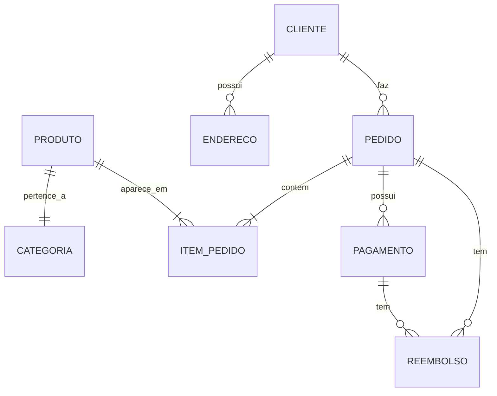

## 4. Modelo dados

O processo de modelagem de dados em desenvolvimento de uma API é indispensável, geralmente é dividido em várias etapas, que podem variar dependendo da metodologia de desenvolvimento de software adotada, podendo ter um time responsável somente por esses processos. Aqui está uma possível divisão desse processo em etapas:

1. **Análise de requisitos:** Nessa etapa, a equipe de desenvolvimento trabalha em conjunto com o cliente para entender as necessidades e objetivos do projeto. A equipe deve identificar as entidades e relações que farão parte do modelo de dados, bem como as regras de negócio que afetam o armazenamento e recuperação de informações.

2. **Modelo conceitual:** Com base na análise de requisitos, a equipe cria um modelo de dados conceitual, que descreve as entidades, atributos e relações que farão parte do modelo. Esse modelo geralmente é representado por meio de diagramas de entidade-relacionamento (ER), que mostram as entidades como caixas e as relações entre elas como linhas.

3. **Modelo lógico:** Nessa etapa, o modelo conceitual é refinado e transformado em um modelo de dados lógico, que representa como os dados serão armazenados em um banco de dados específico. O modelo lógico é projetado para atender aos requisitos de desempenho, segurança e integridade de dados, e geralmente é representado por meio de esquemas de tabelas e relacionamentos.

4. **Modelo físico:** Nessa etapa, o modelo de dados lógico é implementado em um banco de dados específico, levando em consideração as características físicas do hardware e do sistema de armazenamento. Isso inclui a escolha de índices, partições e outros recursos de otimização para maximizar a eficiência do acesso aos dados.

5. **Teste e validação:** Depois que o modelo de dados é implementado, a equipe realiza testes e validações para garantir que os dados sejam armazenados e recuperados corretamente. Isso inclui testes de integração, testes de desempenho e testes de segurança para garantir que o modelo de dados atenda aos requisitos do cliente e aos padrões de qualidade da empresa.

Essas etapas podem ser iterativas e podem ser realizadas em paralelo com outras etapas do processo de desenvolvimento de software, como design de interface de usuário, desenvolvimento de código e testes de unidade. A colaboração e comunicação efetiva entre os membros da equipe e as partes intereçadas são fundamentais para garantir que o modelo de dados atenda às necessidades do projeto e da empresa.

Entre essas etapas iremos destacar:

### Modelo conceitual

Um modelo conceitual de dados pode ser representado de diversas formas, dependendo do contexto de uso e das necessidades da aplicação. por exemplo um diagrama entidade-relacionamento (ER) que descreve as entidades (tabelas), os atributos (colunas) e os relacionamentos entre essas entidades.Imagine uma aplicação de e-commerce que precisa armazenar informações sobre produtos, clientes e pedidos. Para cada uma dessas entidades, é necessário criar um modelo de dados que defina os campos e as relações com outras entidades. O modelo de dados para a entidade "produto", por exemplo, pode incluir campos como nome, descrição, preço e quantidade em estoque. Por exemplo, em uma aplicação de e-commerce, podemos ter as seguintes entidades:

- **Cliente**: representa um usuário que está navegando e comprando na loja online. Pode ter atributos como nome, e-mail e senha.
- **Produto**: representa um item que está à venda na loja online. Pode ter atributos como nome, descrição, preço e quantidade em estoque.
- **Categoria**: representa uma categoria na qual um produto pode ser classificado. Pode ter atributos como nome e descrição.
- **Endereço**: representa o endereço de um cliente. Pode ter atributos como rua, número, complemento, cidade, estado e CEP.
- **Pedido**: representa um pedido feito por um cliente. Pode ter atributos como data de criação, status e valor total.
- **Item_Pedido**: representa um item que foi adicionado a um pedido. Pode ter atributos como quantidade e valor unitário.
- **Pagamento**: representa um pagamento feito por um cliente para um pedido. Pode ter atributos como data de criação, valor e status.
- **Reembolso**: representa um reembolso que foi emitido para um cliente em relação a um pedido. Pode ter atributos como data de criação, valor e status.

Um diagrama ER simples para este modelo de dados seria:



Nesse diagrama, cada tabela é representada por um retângulo, e os relacionamentos entre as tabelas são indicados por linhas que conectam os retângulos. A cardinalidade do **relacionamento** é indicada por símbolos no final de cada linha.

Uma vez definido o modelo conceitual de dados, podemos utilizá-lo para criar o modelo de dados em Node.js que ira realizar operações no banco de dados, como inserir novos registros, atualizar informações existentes ou recuperar dados para exibir na interface do usuário. Isso é feito através de um ORM, que traduz as operações de banco de dados em chamadas a métodos do modelo correspondente.

### Modelo lógico: e ORM Sequelize

Em resumo, um modelo lógico é uma representação mais detalhada do sistema, que utiliza uma linguagem formal para definir as entidades, atributos, relacionamentos e regras de negócio. Nessa etapa, o modelo conceitual é traduzido para o modelo lógico, que pode ser implementado em um banco de dados. O modelo lógico é independente de tecnologia, ou seja, pode ser implementado em diferentes sistemas gerenciadores de banco de dados.

### ORM

ORM (Object-Relational Mapping) é uma técnica de programação que permite mapear objetos de um modelo lógico para uma tabela em um banco de dados relacional. Isso permite que o desenvolvedor trabalhe com objetos em vez de escrever diretamente SQL para interagir com o banco de dados.

O ORM fornece uma camada de abstração entre o código da aplicação e o banco de dados, permitindo que as consultas SQL sejam geradas automaticamente com base nas operações feitas nos objetos. Isso torna o desenvolvimento de aplicativos mais produtivo e reduz a complexidade de escrever e manter o código SQL.

Geralmente os ORMs têm a capacidade de realizar operações básicas de CRUD (criação, leitura, atualização e exclusão) em tabelas de banco de dados, bem como gerenciar as relações entre as tabelas. Alguns exemplos de ORMs populares incluem Sequelize para Node.js, Hibernate para Java e Entity Framework para .NET, SQLAlchemy para Python, entre outras.

Embora possam ter um impacto positivo no desenvolvimento de aplicativos, Os ORMs também têm algumas desvantagens. Por exemplo, pode ser menos eficiente do que o SQL direto, pois a geração de SQL pode adicionar camadas adicionais de abstração e, portanto, diminuir a velocidade de execução. Além disso, os ORMs podem ser menos flexíveis do que o SQL direto, pois a geração automática de SQL pode ser limitada em alguns casos específicos.

### Sequelize

O Sequelize é um Object-Relational Mapping (ORM) para Node.js, que permite trabalhar com bancos de dados relacionais de forma mais fácil e produtiva. O Sequelize é uma ferramenta poderosa e fácil de usar, que oferece suporte a vários bancos de dados relacionais e recursos avançados, como migrações de banco de dados.Para utilizar o Sequelize em um projeto Node.js, é necessário instalá-lo através do NPM (Node Package Manager). Abaixo está o comando para instalar o `Sequelize`:

```bash
npm i sequelize
```

- O `sequelize` é um pacote que permite a realização de operações de banco de dados em um projeto Node.js, fornecendo uma interface simples e poderosa para interagir com bancos de dados relacionais. Ao utilizar o comando `npm i sequelize`, o pacote `sequelize` será instalado no diretório `node_modules` do projeto, e sua referência será adicionada ao arquivo `package.json`, na seção `dependencies`. A instalação do `sequelize` é necessária para que a aplicação possa utilizar as funcionalidades do ORM e interagir com o banco de dados de forma eficiente e segura.

```bash
npm i pg-hstore
```

- O `pg` é um pacote que fornece uma interface Node.js para interagir com o PostgreSQL. Ele permite que o Sequelize se conecte ao banco de dados e execute operações de leitura e gravação de dados de forma segura e eficiente.

- O `pg-hstore` é um pacote que permite a conversão de objetos JavaScript para a representação de texto hstore do PostgreSQL, que é usado para armazenar pares de chave-valor em uma coluna de banco de dados. Ele é necessário quando se deseja utilizar a funcionalidade hstore do PostgreSQL com o Sequelize.

A instalação desses pacotes é necessária para que a aplicação possa se conectar ao banco de dados PostgreSQL e realizar operações de leitura e gravação de dados de forma segura e eficiente, utilizando o Sequelize como ORM, para outros bancos consulte a documentção do [Sequelize](https://sequelize.org/docs/v6/getting-started/).

```bash
npm i sequelize-cli -D
```

- O `sequelize-cli` é uma ferramenta de linha de comando que facilita a criação de migrações de banco de dados, a geração de modelos e a criação de arquivos de configuração para o Sequelize. Ele é uma extensão do pacote `sequelize`, que é utilizado para realizar operações de banco de dados em um projeto Node.js. Ao utilizar o comando `npm i sequelize-cli -D`, o pacote `sequelize-cli` será instalado no diretório `node_modules` do projeto, e sua referência será adicionada ao arquivo `package.json`, na seção `devDependencies`. A opção `-D` indica que a dependência será instalada como uma dependência de desenvolvimento, ou seja, ela não será necessária para a execução da aplicação em produção, apenas para o desenvolvimento e testes.

Após a instalação, é necessário configurar a conexão com o banco de dados PostgreSQL. Para isso, iremos criar dois arquivos:

---

### sequelizerc

- `.sequelizerc`: arquivo de configuração do Sequelize que permite personalizar o comportamento do CLI do Sequelize. Ele é usado para especificar diretórios e arquivos personalizados que podem ser usados pelo Sequelize para gerar código automaticamente, como arquivos de migração, modelos, seeders, etc.

podemos criar o arquivo com o comando:

```bash
touch .sequelizerc
```

O comando ira criar o  arquivo vazio `.sequelizerc`, que é um arquivo no formato JavaScript (sem extenção .js) adicione o seguinte codigo:

```javascript
const { resolve } = require("path");

module.exports = {
  config: resolve(__dirname, "src", "config", "database.js"),
  "models-path": resolve(__dirname, "src", "app", "models"),
  "migrations-path": resolve(__dirname, "src", "database", "migrations"),
  "seeders-path": resolve(__dirname, "src", "database", "seeds"),
};

```

Entenda melhor linha a linha do arquivo `.sequelizerc`:

```javascript
const { resolve } = require("path");
```

Esta linha está importando o método `resolve` do módulo `path` do Node.js. O método `resolve` é usado para resolver caminhos de arquivos e diretórios, garantindo que os caminhos sejam corretamente concatenados e formatados independentemente do sistema operacional.

```javascript
module.exports = {
```

Aqui estamos exportando um objeto que contém as configurações do Sequelize. Isso permite que outras partes do código possam acessar as configurações exportadas.

```javascript
  config: resolve(__dirname, "src", "config", "database.js"),
```

Definindo o caminho para o arquivo de configuração do Sequelize `src/config/database.js`.

```javascript
  "models-path": resolve(__dirname, "src", "app", "models"),
```

Caminho para o diretório que contém os modelos do Sequelize `src/app/models`.

```javascript
  "migrations-path": resolve(__dirname, "src", "database", "migrations"),
```

Definindo o caminho para o diretório que contém as migrações do Sequelize `src/database/migrations`.

```javascript
  "seeders-path": resolve(__dirname, "src", "database", "seeds"),
};
```

Por fim, aqui estamos definindo o caminho para o diretório que contém os seeders do Sequelize`src/database/seeds`.

Com essas configurações em `.sequelizerc`, o Sequelize será capaz de encontrar os arquivos necessários nos diretórios corretos para executar as operações de banco de dados.

---

### database.js

- `database.js`: com as informações necessárias para a conexão, é uma boa prática em uma aplicação Node.js separar os os arquivos de código em diretorios, é comum encontrarmos um `src` e dentro um diretório de configuração `config`. Essa separação ajuda a manter o código organizado e facilita a manutenção, uma vez que as configurações estão centralizadas em um só lugar.

podemos criar o diretorio de config com o comando:

```bash
mkdir -p src/config/ && touch src/config/database.js
```

isso ira criar um diretorio `src/config/`  e dentro de config um arquivo vazio com o nome `database.js`, para adicionar as configuraçoes do banco adicione o codigo a seguir em `database.js`:

```javascript
// src/config/database.js
module.exports = {
  dialect: "postgres",
  host: "localhost",
  username: "postgres",
  password: "123",
  database: "node",
  define: {
    timestamp: true, // cria duas colunas: createdAt e updatedAt
    underscored: true,
    underscoredAll: true,
  },
};
```

- `dialect`: o tipo de banco de dados que você está usando, nesse caso PostgresSQL
- `host`: o nome ou endereço IP do servidor do banco de dados
- `username`: o nome de usuário usado para conectar-se ao banco de dados
- `password`: a senha associada ao usuário
- `database`: o nome do banco de dados que o aplicativo irá conectar
- `define`: um objeto de configuração para definir as opções de modelagem do Sequelize, um ORM (Object-Relational Mapping) do Node.js que é frequentemente usado com o PostgresSQL. As opções definidas nesse objeto são:
  - `timestamp`: cria duas colunas: `createdAt` e `updatedAt`, que registram a data e hora da criação e atualização de um registro.
  - `underscored`: define se os nomes das tabelas e colunas do banco de dados devem usar letras minúsculas e sublinhados (_) para separar palavras (por exemplo, `nome_da_tabela` em vez de `NomeDaTabela`).
  - `underscoredAll`: define se o mesmo padrão de nomenclatura deve ser aplicado aos nomes dos campos (colunas) dos modelos.

Essas configurações podem variar dependendo do banco de dados e do ORM que você está usando, mas em geral, um arquivo de configuração de banco de dados é usado para armazenar informações de conexão com o banco de dados e opções de configuração específicas do banco de dados e do ORM.

Ao final desta etapa você terá a seguinte estrutura de diretório:

```tree
nome-do-projeto/
├── src/
|   ├── config/
|   │   └── database.js
├── node_modules/
|   └── ... 
├── .sequelizerc
├── package-lock.json
└── package.json
```

- `src/`: diretório que contém o código fonte do projeto.

- `src/config/`: lembre-se este diretório que contém arquivos de configuração para o seu aplicativo, incluindo arquivos de configuração de banco de dados e outros parâmetros globais.

- `src/config/database.js`, que é responsável por definir as configurações de conexão com o banco de dados PostgreSQL, como nome do banco de dados, usuário, senha, host e porta.

### Modelos e Migrações

No contexto de uma API Node.js com Sequelize, modelos e migrações são conceitos relacionados à definição e manipulação de dados no banco de dados.

- **Modelos**: são **classes** que definem a estrutura dos dados que serão **manipulados** pelo aplicativo. Eles são tipicamente definidos com a ajuda do Sequelize, um ORM (Object-Relational Mapping) que fornece uma interface para mapear objetos JavaScript para tabelas de banco de dados relacionais. Os modelos do Sequelize geralmente contêm propriedades que correspondem às colunas da tabela do banco de dados, bem como métodos que permitem criar, ler, atualizar e excluir (CRUD) registros do banco de dados.

- **Migrações**: são arquivos de script que **definem a estrutura da tabela** do banco de dados e as alterações na estrutura da tabela ao longo do tempo. As migrações são normalmente criadas usando uma biblioteca de migração, como o `Sequelize CLI` (Command-Line Interface). As migrações podem ser usadas para criar e alterar tabelas, colunas, índices e chaves estrangeiras. Elas garantem que a estrutura do banco de dados corresponda à estrutura definida pelo modelo do aplicativo.

Na maioria das vezes, é recomendável criar os modelos primeiro e, em seguida, criar as migrações que definem a estrutura da tabela do banco de dados.

Ao criar os modelos primeiro, você pode definir a estrutura de dados que será usada em seu aplicativo e usar esses modelos para gerar as migrações. Isso ajuda a garantir que a estrutura da tabela do banco de dados corresponda à estrutura de dados esperada pelo aplicativo. Além disso, a criação de modelos primeiro permite que você teste e depure sua lógica de negócios sem se preocupar com a estrutura do banco de dados subjacente.

Depois de criar os modelos, você pode usar ferramentas como o Sequelize CLI para gerar automaticamente as migrações com base nesses modelos. As migrações geradas fornecem um ponto de partida sólido para definir a estrutura da tabela do banco de dados e podem ser personalizadas conforme necessário para atender às necessidades específicas do seu aplicativo.

Após a configuração da conexão com o banco de dados, podemos criar modelos para as tabelas que serão utilizadas na aplicação. Os modelos são definidos utilizando o Sequelize e representam as tabelas do banco de dados.

Uma boa prática é salvar os modelos de banco de dados em um diretório chamado `src/models`. Isso ajuda a manter uma estrutura organizada do projeto, facilita a localização dos arquivos e ajuda a evitar confusão com outros tipos de arquivos, como rotas ou controladores.

Ao salvar os modelos em um diretório separado, é possível também criar subdiretórios para organizar os modelos por categoria, se for necessário. Por exemplo, é possível ter um diretório `models/produtos/` para todos os modelos relacionados a produtos ou a um determinado subgrupo, más tenha cuidado para não se perder, mantenha o seu código o mais organizado possível, e lembre-se que outros desenvolvedores podem dar continuidade ao seu projeto.

Com base no modelo conceitual de dados, podemos começar a criar o modelo de dados usando o Sequelize.

Para cada entidade, precisamos criar um `ORM` correspondente no nosso diretorio `src/models`. Vamos criar um arquivo separado para cada modelo, seguindo o padrão de nomenclatura  do Sequelize.

O Sequelize segue um padrão de nomenclatura para a criação de modelos, tabelas e colunas no banco de dados, e geralmente segue as seguintes convenções:

- Os nomes das tabelas no banco de dados devem ser no plural e em letras minúsculas, underscore (`_`) para separar as palavras  (exemplo: `usuarios`, `itens_pedidos`).
- Os nomes das colunas no banco de dados devem ser em letras minúsculas e separados por underscore `_` (exemplo: `primeiro_nome`, `ultimo_nome`).
- Os nomes dos modelos no Sequelize devem seguir o padrão de nomenclatura "PascalCase". Isso significa que o nome do modelo deve ter a primeira letra de cada palavra em maiúscula, sem espaços ou caracteres especiais, (exemplo: `Usuario`, `ItemPedido`,).
- As propriedades dos modelos no Sequelize devem seguir o mesmo padrão de nomenclatura das colunas no banco de dados (exemplo: `firstName`, `lastName`, `createdAt`).

Essas convenções ajudam a manter a consistência e a legibilidade do código ao trabalhar com o Sequelize. No entanto, é possível personalizar o padrão de nomenclatura do Sequelize usando as configurações do modelo e do Sequelize.

Começaremos criando O Modelo "Clientes" com os seguintes campos: **nome**, **emal** e **senha**. O arquivo de modelo para Clientes deve ficar assim:

```javascript
// src/models/Clientes.js

// Importa as classes Sequelize e Model do pacote Sequelize
const { Sequelize, Model } = require('sequelize');

// Define a classe Clientes, que estende a classe Model
class Clientes extends Model {

  // Define o método init, que é chamado para inicializar a classe com as colunas da tabela do banco de dados
  static init(sequelize) {
    // Chama o construtor da classe Model para definir as colunas da tabela
    super.init(
      {
        nome: Sequelize.STRING, // Coluna "nome" do tipo STRING
        email: Sequelize.STRING, // Coluna "email" do tipo STRING
        senha: Sequelize.STRING, // Coluna "senha" do tipo STRING
      },
      {
        sequelize, // Objeto de conexão com o banco de dados
      }
    );
  }
  // Define o método associate, que é chamado para definir as associações entre as tabelas do banco de dados
  static associate(models) {
    // Define a associação "hasMany" entre a tabela Clientes e a tabela Enderecos
    // Isso significa que um cliente pode ter vários endereços
    this.hasMany(models.Enderecos);
  }
}
// Exporta a classe Clientes para uso em outros módulos
module.exports = Clientes;

```

```javascript
// src/models/Clientes.js

// Importa as classes Sequelize e Model do pacote Sequelize
const { Sequelize, Model } = require('sequelize');

// Define a classe Enderecos, que estende a classe Model
class Enderecos extends Model {

  // Define o método init, que é chamado para inicializar a classe com as colunas da tabela do banco de dados
  static init(sequelize) {
    // Chama o construtor da classe Model para definir as colunas da tabela
    super.init(
      {
        cep: Sequelize.STRING, // Coluna "cep" do tipo STRING
        logradouro: Sequelize.STRING, // Coluna "logradouro" do tipo STRING
        complemento: Sequelize.STRING, // Coluna "complemento" do tipo STRING
        bairro: Sequelize.STRING, // Coluna "bairro" do tipo STRING
        localidade: Sequelize.STRING, // Coluna "localidade" do tipo STRING
        uf: Sequelize.STRING, // Coluna "uf" do tipo STRING
        cliente_id:  Sequelize.INTEGER // Coluna "cliente_id" do tipo INTEGER, que armazena a chave estrangeira da tabela Clientes
      },
      {
        sequelize, // Objeto de conexão com o banco de dados
      }
    );
  }

  // Define o método associate, que é chamado para definir as associações entre as tabelas do banco de dados
  static associate(models) {
    // Define a associação "belongsTo" entre a tabela Enderecos e a tabela Clientes
    // Isso significa que um endereço pertence a um cliente
    this.belongsTo(models.Clientes, { foreignKey: "cliente_id" }); // Define a chave estrangeira da tabela Clientes
  }
}

// Exporta a classe Enderecos para uso em outros módulos
module.exports = Enderecos;
```

Podemos criar os modelos restantes seguindo o mesmo padrão, ao final desta etapa você tera a seguinte estrutura de diretorio:

```tree
nome-do-projeto/
├── src/
|   ├── config/
|   │   └── database.js
|   ├── models
|   |   └── Clientes.js
|   |   └── Enderecos.js
|   |   └── ...
├── node_modules/
|   └── ... 
├── .sequelizerc
├── package-lock.json
└── package.json
```

Agora podemos construir as **migrations**, podemos criar um diretorio `database/migratios`, que ja referenciamos no `.sequelizerc` na linha `migrations-path`, apos a criação dos diretorio podemos utilizar o **sequelize-cli** para gerar um migration:

Para gerar uma migração usando o Sequelize CLI, você pode usar o comando `sequelize migration:generate`, seguido pelo nome da migração que você deseja criar. Por exemplo:

```bash
sequelize migration:generate --name create_clientes

```

O comando acima irá gerar um novo arquivo de migração com o nome composto pela `data da migraçao` e o nome `create_clientes`. Dentro do arquivo gerado, você pode definir as operações que serão executadas na tabela do banco de dados, como criar uma nova tabela, adicionar ou remover colunas, entre outras, no exemplo abaixo iremos criar a tabela cliente:

```javaScript
// src/database/migrations/{numero-migration}-create_clientes.js
// Exporta um objeto com os métodos up e down
module.exports = {
  // Método up é responsável por criar a tabela "clientes"
  up: (queryInterface, Sequelize) => {
    // Utiliza o objeto queryInterface para criar a tabela "clientes"
    return queryInterface.createTable("clientes", {
      // Coluna "id", do tipo INTEGER, não pode ser nula, é auto-incremental e chave primária
      id: {
        type: Sequelize.INTEGER,
        allowNull: false,
        autoIncrement: true,
        primaryKey: true,
      },
      // Coluna "nome", do tipo STRING, não pode ser nula
      nome: {
        type: Sequelize.STRING,
        allowNull: false,
      },
      // Coluna "email", do tipo STRING, não pode ser nula e é única (não permite repetições)
      email: {
        type: Sequelize.STRING,
        allowNull: false,
        unique: true,
      },
      // Coluna "senha", do tipo STRING, não pode ser nula
      senha: {
        type: Sequelize.STRING,
        allowNull: false,
      },
      // Coluna "created_at", do tipo DATE, não pode ser nula
      created_at: {
        type: Sequelize.DATE,
        allowNull: false,
      },
      // Coluna "updated_at", do tipo DATE, não pode ser nula
      updated_at: {
        type: Sequelize.DATE,
        allowNull: false,
      },
    });
  },

  // Método down é responsável por remover a tabela "clientes"
  down: (queryInterface) => {
    // Utiliza o objeto queryInterface para remover a tabela "clientes"
    return queryInterface.dropTable("clientes");
  },
};

```

aplicando a migração:

```bash
sequelize db:migrate

```

Depois de definir as operações, você pode executar a migração usando o comando `sequelize db:migrate`. Isso irá aplicar as alterações no banco de dados.

para gerar a migraçao do models `Enderecos` o processo e bem parecido:

```bash
sequelize migration:generate --name create_enderecos

```

Novamente  irá gerar um novo arquivo de migração com o nome composto pela `data da migraçao` e o nome `create_enderecos`. Dentro do arquivo gerado, defina a estrutura da `migrations` **Enderecos**:

```javaScript
// // src/database/migrations/{data}-create_enderecos.js
module.exports = {
  // Método up é responsável por criar a tabela "enderecos"
  up: (queryInterface, Sequelize) => {
    // Utiliza o objeto queryInterface para criar a tabela "enderecos"
    return queryInterface.createTable("enderecos", {
      id: {
        type: Sequelize.INTEGER,
        allowNull: false,
        autoIncrement: true,
        primaryKey: true,
      },
      cep: {
        type: Sequelize.STRING,
        allowNull: true,
      },
      logradouro: {
        type: Sequelize.STRING,
        allowNull: true,
      },
      complemento: {
        type: Sequelize.STRING,
        allowNull: true,
      },
      bairro: {
        type: Sequelize.STRING,
        allowNull: true,
      },
      localidade: {
        type: Sequelize.STRING,
        allowNull: true,
      },
      uf: {
        type: Sequelize.STRING,
        allowNull: true,
      },
      created_at: {
        type: Sequelize.DATE,
        allowNull: false,
      },
      updated_at: {
        type: Sequelize.DATE,
        allowNull: false,
      },
      cliente_id: { // coluna referenciando o id da tabela clientes
        type: Sequelize.INTEGER,
        references: { model: "clientes", key: "id" }, // faz referência à tabela clientes
        onUpdate: "CASCADE", // quando o id do cliente for atualizado, atualiza também na tabela de endereços
        onDelete: "CASCADE", // quando um cliente for deletado, deleta também todos os seus endereços
        allowNull: false, // não permite valores nulos para essa coluna
      },
    });
  },

  down: queryInterface => {
    return queryInterface.dropTable("enderecos"); // remove a tabela de endereços
  },
};
```

nao esqueça de aplicar a migração:

```bash
sequelize db:migrate

```

Ao final desta etapa você tera a seguinte estrutura de diretorio:

```tree
nome-do-projeto/
├── src/
|   ├── config/
|   │   └── database.js
|   ├── database
|   |   ├── migrations/
|   |   |   └── Enderecos.js
|   |   |   └── Clientes.js
|   ├── models
|   |   └── Clientes.js
|   |   └── Enderecos.js
|   |   └── ...
├── node_modules/
|   └── ... 
├── .sequelizerc
├── package-lock.json
└── package.json
```

Além disso, você pode usar opções adicionais com o comando `sequelize migration:generate`, como `--help` para ver a lista completa de opções disponíveis.

segue alguns comandos uteis do sequelize-cli:

| Comando                                            | Descrição                                                             |
| -------------------------------------------------- | --------------------------------------------------------------------- |
| `sequelize init`                                   | Inicia um novo projeto do sequelize-cli no diretório atual            |
| `sequelize model:generate --name User --attributes` | Gera um novo modelo de usuário com atributos especificados            |
| `sequelize db:create`                              | Cria um novo banco de dados com base nas configurações do sequelize    |
| `sequelize db:migrate`                             | Executa as migrações de banco de dados pendentes                       |
| `sequelize db:seed:all`                            | Executa todos os arquivos de sementes disponíveis                      |
| `sequelize db:drop`                                | Elimina todas as tabelas do banco de dados configurado                 |
| `sequelize migration:create`                       | Cria um novo arquivo de migração vazio                                  |
| `sequelize migration:run`                          | Executa todas as migrações de banco de dados pendentes                  |
| `sequelize migration:undo`                         | Reverte a migração mais recente                                          |
| `sequelize seed:generate --name User`              | Gera um novo arquivo de semente para a tabela de usuários especificada |

### Conectando os Models

Conectar os modelos (models) com o banco de dados utilizando Sequelize significa utilizar a biblioteca Sequelize para criar uma conexão entre a aplicação e o banco de dados relacional, além de definir e sincronizar os modelos com as tabelas do banco de dados.
O Sequelize é responsável por mapear os objetos JavaScript definidos na aplicação para as tabelas do banco de dados. Para conectar os modelos com o banco de dados, é necessário definir os modelos utilizando a sintaxe do Sequelize, especificando os atributos e as relações entre os modelos, e em seguida, criar a conexão com o banco de dados utilizando as credenciais e as configurações necessárias.
Para isso podemos cria um arquivo `src/database/index.js` para definir as configurações da conexão do Sequelize com o banco de dados. Esse arquivo pode conter o seguinte código:

```javaScript
// src/database/index.js
const Sequelize = require("sequelize"); // Importa a biblioteca Sequelize
const config = require("../config/database"); // Importa as configurações do banco de dados
const Clientes = require("../models/Clientes"); // Importa o modelo de Clientes
const Enderecos = require("../models/Enderecos"); // Importa o modelo de Endereços

const models = [Clientes, Enderecos]; // Array com os modelos que serão sincronizados

class Database {
  constructor() {
    this.connection = new Sequelize(config); // Cria uma conexão com o banco de dados utilizando as configurações
    this.init(); // Inicializa os modelos
  }

  init() {
    models.forEach(model => model.init(this.connection)); // Inicializa cada modelo, passando a conexão como parâmetro
  }
}

module.exports = new Database(); // Exporta a instância da classe Database já inicializada. Isso garante que haja apenas uma instância da conexão em toda a aplicação.

```

O código contido em `src/database/index.js` é responsável por configurar a conexão do Sequelize com o banco de dados e inicializar os modelos definidos na aplicação.

As principais etapas do código são:

1. Importar a biblioteca Sequelize, as configurações do banco de dados e os modelos da aplicação.

    ```javaScript
    const Sequelize = require("sequelize"); // Importa a biblioteca Sequelize
    const config = require("../config/database"); // Importa as configurações do banco de dados
    const Clientes = require("../models/Clientes"); // Importa o modelo de Clientes
    const Enderecos = require("../models/Enderecos"); // Importa o modelo de Endereços
    ```

2. Definir um array com os modelos que serão sincronizados com o banco de dados.

    ```javaScript
    const models = [Clientes, Enderecos]; // Array com os modelos que serão sincronizados
    ```

    - Além de criar os modelos com as definições das tabelas, é preciso conectar os modelos ao banco de dados para que eles possam iteragir como tabelas e realizar as operações.

3. Criar uma classe `Database` que representa a conexão do Sequelize com o banco de dados e os modelos da aplicação.

    ```javaScript
    class Database {
    constructor() {
        this.connection = new Sequelize(config); // Cria uma conexão com o banco de dados utilizando as configurações
        this.init(); // Inicializa os modelos
    }

    init() {
        models.forEach(model => model.init(this.connection)); // Inicializa cada modelo, passando a conexão como parâmetro
    }
    }
    ```

4. Exportar uma instância da classe `Database` já inicializada. Isso garante que haja apenas uma instância da conexão em toda a aplicação.

    ```javaScript
    module.exports = new Database();
    ```

Em resumo, o código configura a conexão do Sequelize com o banco de dados e define os modelos que serão utilizados na aplicação, permitindo que eles sejam sincronizados com o banco de dados.

Ao final desta etapa você tera a seguinte estrutura de diretorio:

```tree
nome-do-projeto/
├── src/
|   ├── config/
|   │   └── database.js
|   ├── database
|   |   ├── migrations/
|   |   |   └── data-clientes.js
|   |   |   └── data-enderecos.js
|   |   └── index.js
|   ├── models
|   |   └── Clientes.js
|   |   └── Enderecos.js
|   |   └── ...
├── node_modules/
|   └── ... 
├── .sequelizerc
├── package-lock.json
└── package.json
```
